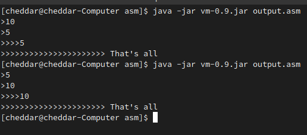
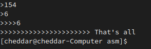
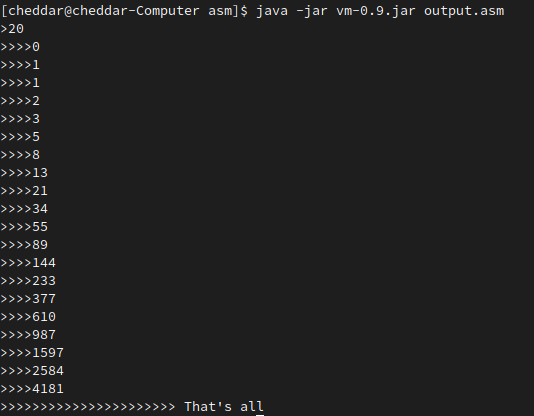
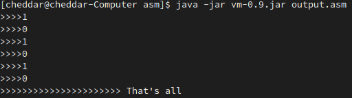

# TP2-INFO805

Membre du groupe: 
Irilind Salihi
 
## TP2 - Petit programme qui affiche a ou b en fonction des valeurs choisis :

```
let a = input;
let b = input;
if a <= 5 or b < 9 then output b else output a.
```



---
## Exemple du tp avec le PGCD de deux nombres :

```
let a = input;
let b = input;
while (0 < b)
do (let aux=(a mod b); let a=b; let b=aux );
output a.
```



---
## Suite Fibonaci

```
let nombre = input;
let nb = 0;
let a = 0;
let b = 1;
let total = 0;
while(nb < nombre)
do(let nb = nb + 1; output total; let a = b; let b = total; let total = a + b).
```


---
## Programme pour tester les not() à la suite

```
if (not(not(not(not(not(4 < 5 and 3 = 2)))))) then output 1 else output 0;
if (not(not(not(not(4 < 5 and 3 = 2))))) then output 1 else output 0;
if (not(not(not(4 < 5 and 3 = 2)))) then output 1 else output 0;
if (not(not(4 < 5 and 3 = 2))) then output 1 else output 0;
if (not(4 < 5 and 3 = 2)) then output 1 else output 0;
if ((4 < 5 and 3 = 2)) then output 1 else output 0.
```

